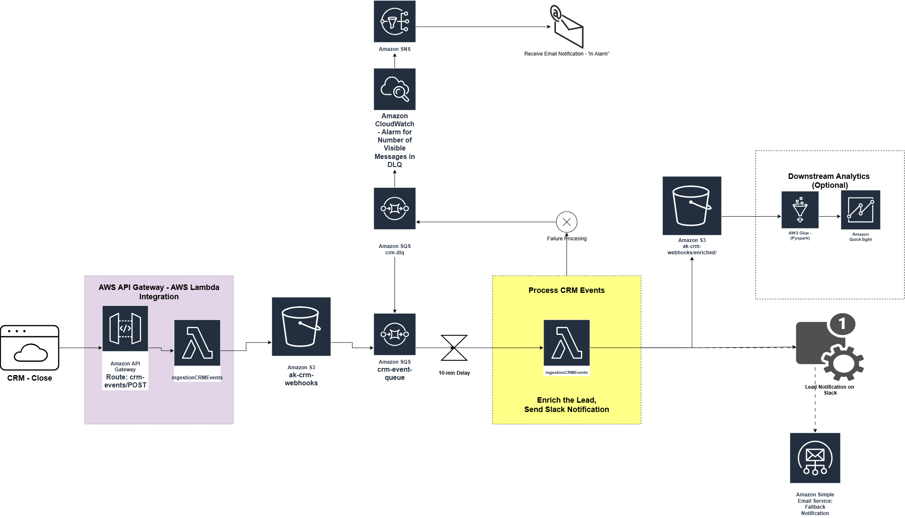
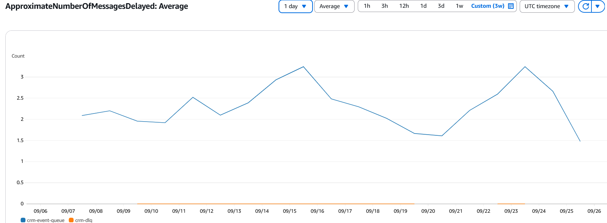
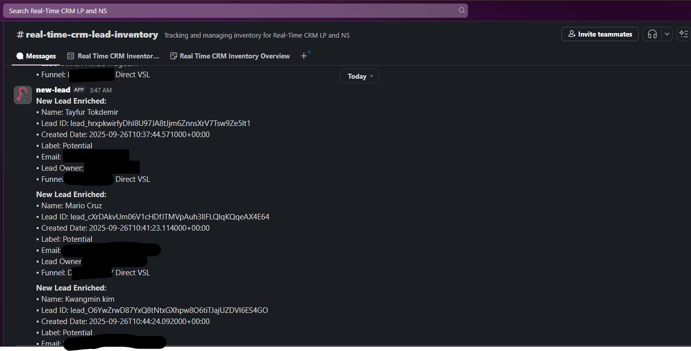
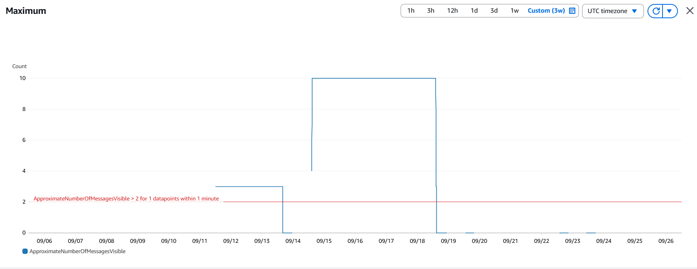

# Real-Time CRM Lead Processing and Notification System

This project implements an **event-driven lead processing and notification pipeline** on AWS. It ingests leads from a CRM, enriches them, and sends notifications to downstream consumers (Slack, SES) in real time. The solution is designed for reliability, observability, and extensibility.

---

## Infrastructure Set Up (Microservices and Service Enablement)

* **AWS S3**:

  * s3 bucket root-level for ingesting raw CRM leads.
  * `enriched/` folder for processed and validated leads.

* **AWS Lambda Functions**:

  * **Ingest Lambda**: Writes incoming leads into `s3://ak-crm-webhooks`.
  * **Enrichment Lambda**: Cleanses, validates, and enriches leads before writing to `enriched/`.
  * **Notification Lambda**: Sends notifications to Slack (primary) or SES email (fallback).

* **Amazon SQS**:

  * Buffers events between S3 and Lambdas for rate control and reliability.

* **IAM Roles and Policies**:

  * Granular permissions for Lambda-to-S3, S3-specific resource, Lambda-to-SQS, and notification services.

* **CloudWatch Monitoring**:

  * Metrics for Lambda executions, SQS message flow, and errors.
  * Logging enabled for observability and troubleshooting.
  * Alarm action enabled to send to an *SNS Topic* that triggers an email.

---

## Architecture Diagram

```mermaid
flowchart TD
  A[CRM Source Leads] -->|Drop into S3| B[Ingest Lambda]
  B -->|Trigger| C[SQS Queue]
  C -->|Event| D[Enrichment Lambda]
  C -->|Failures| I[Dead Letter Queue (DLQ)]
  I -->|Metric| J[CloudWatch Alarm\n(>2 Messages Visible)]
  J -->|Alarm Action| K[SNS Topic]
  K -->|Notify| L[PagerDuty / Email / On-call]

  D -->|Write Enriched Data| E[S3 enriched/]
  D -->|Trigger Notification| F[Notification Lambda]
  F -->|Primary| G[Slack Channel]
  F -->|Fallback| H[SES Email]
```



---

## Observations

* Slack notifications are currently received after a **10-minute delay**, traced to SQS + Lambda batching behavior.



* During burst testing (10 parallel mock leads with identical timestamps), a spike was observed in SQS `NumberOfMessagesSent` as expected. Further validation is needed on event triggers and permissions. SQS handled all of them with 10-min delay.
* SES fallback is feasible using **sandbox mode** (limited to verified emails). This is suitable for development before moving to production with a dedicated domain.
* CloudWatch logging confirms successful deployment and event traces after fixing the **Lambda deployment role mismatch**.
* SQS Dead-Letter Queue message retention period is 4 days after which the messages would be auto-purged. 

---

## Assumptions

* Leads dropped into S3 are assumed to be **well-formed JSON payloads**.
* For SES fallback, sandbox restrictions are acceptable for now.
* Slack is treated as the **primary notification channel**, SES as secondary.
* Downstream consumers expect enriched leads to be in `enriched/` with consistent schema.

---

## Key Steps

1. **Infrastructure Creation**

   * Set up S3, Lambda, SQS, SNS Topic, IAM roles, and permissions.

2. **Service Enablement**

   * Configured Slack app for incoming webhooks.
   * Enabled SES in sandbox mode for email fallback.

3. **Event Flows**

   * Verified Lambda → S3 writes and reads.
   * Connected SQS between enrichment and notification layers for rate-limiting.
   * Set up Dead-Letter Queue attached to the main queue with a maximum receive count of 3 (sending to Lambda before DLQ receives the messages)

4. **Testing**

   * Dropped mock leads manually to S3.
   * Verified notifications in Slack with enrichment workflow.

   

   * Identified bottlenecks in burst testing and delayed notification delivery.

5. **Deployment Fix**

   * Fixed IAM role mismatch where Lambda was deployed but not properly attached to execution roles.
   * Validated successful execution after redeployment with corrected roles.

6. **Structured Logging**

   * CloudWatch logs standardized across all Lambdas for better traceability.
   * Cloudwatch alarm is set up using the `ApproximateNumberOfMessagesVisible` to identify if the alarm is active and the messages from DLQ need to be restored back to the main queue.

   

---

## Downstream Consumption

* **Slack Channel**: Immediate visibility of lead creation for sales/ops teams.
* **SES Email (Fallback)**: Ensures leads are not missed if Slack fails.
* **Enriched S3 Folder**: Provides a **system of record** for further BI/analytics, ETL jobs, or warehouse ingestion.

---

**Next Steps**

* Improve **parallel processing** for bursty lead traffic, increase the burst volume.
* Optimize SQS batch size / Lambda concurrency for reducing delays.
* Exit SES sandbox for production readiness.
* Add more downstream consumers (e.g., DynamoDB or Redshift for analytics).

